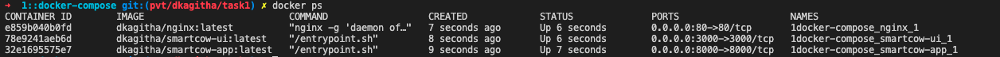

## SmartCow - Task 1::
### DOCKER COMPOSE [ MULTI CONTAINER SETUP ] + WEBSERVER(NGINX - REVERSE PROXY) + APPSERVER(GUNICORN)

`DOCKER COMPOSE :`

1. Stay at root (where you have the docker-compose.yml)
    ```bash
    $ cd <root directory > ex: 1-docker-compose
    ```    

2. `Build` the images 
    ```bash
    $ docker-compose build
    ```
3. `Run` the containers
    ```bash
    $ docker-compose up -d

    ```
4. Bring down the containers
    ```bash
    $ docker-compose down
    ```
5. Alternatively, can run `run_docker.sh` - it would delete currently running dockers on the local machine and rebuild the dockers and brung them up 
    ```bash
    $ cd <root directory > of the subproject => 1::docker-compose
    $ ./run_docker.sh 
    ```
    


`VALIDATE :`

1. Access SmartCow Stats UI on any `browser`

    ```bash
    $ http://localhost
    ```  
    `Recorded and attached a .gif for better review` 
    
   

    `Note` : UI would take ~1 min to come up and eventually for NGINX to proxy the request and send the response back to the browser


2. Can check the response of both the backend(flask) and frontend(node application) 

    `backend - gunicorn serving flask app exposed at 8000; endpoint "/stats"`
    ```bash
    $ http://localhost:8000/stats
    ```  
    
`CURRENT APPROACH :`

1. Dockerise the frontend, backend and the webserver/proxy (nginx)

    `Original Project Structure` 
    ```bash

    $ (smartCow-venv) ➜  SmartCow git:(pvt/dkagitha/task-1) ✗ tree  -I 'smartCow-venv|node_modules|*pycache*'
    .
    ├── README.md
    ├── REQUIREMENTS.md
    ├── api
    │   ├── app.py
    │   └── requirements.txt
    ├── img
    │   └── readme.jpg
    └── sys-stats
        ├── README.md
        ├── package-lock.json
        ├── package.json
        ├── public
        │   ├── favicon.ico
        │   ├── index.html
        │   ├── logo192.png
        │   ├── logo512.png
        │   ├── manifest.json
        │   └── robots.txt
        ├── src
        │   ├── App.css
        │   ├── App.js
        │   ├── App.test.js
        │   ├── index.css
        │   ├── index.js
        │   ├── logo.svg
        │   ├── reportWebVitals.js
        │   └── setupTests.js
        └── yarn.lock

    5 directories, 23 files
    ```

    `1.1` Dockerise :: Flask 

    - Structure the existing into (reduced the tree level o/p to 4 as the `public` and `src` directory content is unaltered )
        
        ```bash
        ➜  1::docker-compose git:(pvt/dkagitha/task1) ✗ tree  -I 'smartCow-venv|node_modules|*pycache*|AWSCLIV2.pkg|img' -L 4
        .
        ├── README.md
        ├── api
        │   └── docker
        │       ├── Dockerfile
        │       ├── README.md
        │       ├── core
        │       │   ├── app.py
        │       │   ├── requirements.txt
        │       │   └── wsgi.py
        │       └── entrypoint.sh
        ├── docker-compose.yml
        ├── nginx
        │   ├── Dockerfile
        │   ├── nginx.conf
        │   └── project.conf
        ├── run_docker.sh
        └── sys-stats
            ├── README.md
            └── docker
                ├── Dockerfile
                ├── core
                │   ├── package.json
                │   ├── public
                │   ├── src
                │   └── yarn.lock
                └── entrypoint.sh

        9 directories, 17 files
        ```    
    
    - So added each of the original component level code into a docker directory each and moved the core application into `core` directory unaltered. In the docker directory added the 
        -   `Dockerfile` - Snippet, access the Dockerfile for complete content

            -The working directory is `core`, since the application code is moved into core directory
            ```
            WORKDIR /core
            COPY ./core /core            
            ```
            
            -`ENTRYPOINT` would be an execution of a bash file , we can either pass an CMD or run the gunicorn command in `docker-compose` , more details in `BEST PRACTICES` section
            ```
            COPY ./entrypoint.sh /
            RUN chmod +x /entrypoint.sh
            ENTRYPOINT [ "/entrypoint.sh" ]
            ```
            -`entrypoint.sh` - Initialising gunicorn(WSGI server), now the python-flask application - a WSGI compliant web app can be now bridged/hooked to the web facing webserver like nginx.         

            ```
            exec gunicorn wsgi:app \
            --name flask_docker \
            --bind 0.0.0.0:8000 \
            ```

        -   In the `api` directory added the `wsgi` directory as the main function to call the `app` and later pass the gunicorn(WSGI server) command via `entrypoint.sh` to serve the flask application at port `8000` 

    - So now we can build the baceked flask app docker standalone by running docker alone commands 

        ```bash
        $ cd 1::docker-compose/api/docker
        $ docker build -t sc-app .
        $ docker run -d -i sc-app:latest

        # To check if the docker container status
        $ docker ps 

        # curl to see the application response
        $ curl http://localhost:8000/stats

        ```

2. 


`BEST PRACTICES :`

1. Can add Dockerfile.dev ,Dockerfile.pre-prod, Dockerfile.prod 
2. Can use CMD or ENTRYPOINT or pass it in docker-compose.yml `command: gunicorn -w 1 -b 0.0.0.0:8000 wsgi:app` 
3. We need both the wsgi compliant application webserver like gunicorn, uwsgi to be compliant with  - Nginx has some web server functionality (e.g., serving static pages; SSL handling) that gunicorn does not, whereas gunicorn implements WSGI (which nginx does not).


```bash
end_of_line = lf
```