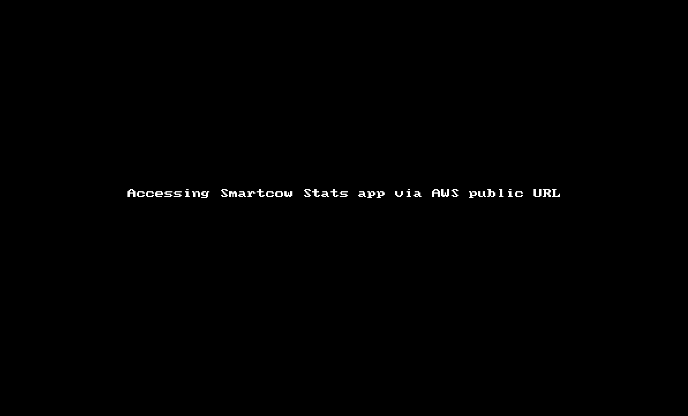

## SmartCow - Task 2::
### DOCKER [ MULTI CONTAINER SETUP ] + CLOUD DEPLOY [ AWS ECS,ECR ]

`CURRENT APPROACH :`

1. `Dockerise` the frontend, backend and the webserver/proxy (nginx) - `Refer` [1::docker-compose-README.md](../1::docker-compose/README.md)

2. Structure the existing into (reduced the tree level o/p to 4 as the `public` and `src` directory content is unaltered )

    ```bash
    ➜  3::kubernetes git:(pvt/dkagitha/task1) ✗ tree  -I 'smartCow-venv|node_modules|*pycache*|AWSCLIV2.pkg|img' -L 4
    ├── README.md
    ├── api
    │   └── docker
    │       ├── Dockerfile
    │       ├── README.md
    │       ├── core
    │       │   ├── app.py
    │       │   ├── requirements.txt
    │       │   └── wsgi.py
    │       └── entrypoint.sh
    ├── docker-compose.yml
    ├── nginx
    │   ├── Dockerfile
    │   ├── nginx.conf
    │   └── server.conf
    ├── run_docker.sh
    └── sys-stats
        └── docker
            ├── Dockerfile
            ├── core
            │   ├── package.json
            │   ├── public
            │   ├── src
            │   └── yarn.lock
            └── entrypoint.sh

    9 directories, 16 files
    ```

`BUILD & PUSH THE IMAGES WITH DOCKER-COMPOSE :`

1. Stay at root (where you have the docker-compose.yml)
    ```bash
    $ cd <root directory > ex: 3::kubernetes
    ```    

2. `Build` the images 
    ```bash
    $ docker-compose build
    ```
3. `Run` the containers
    ```bash
    $ docker-compose up -d

    ```
4. Bring `down` the containers :  ***Optional***
    ```bash
    $ docker-compose down
    ```
5. Alternatively, can run `run_docker.sh` - it would delete currently running dockers on the local machine and rebuild the dockers and brung them up : ***Optional***
    ```bash
    $ cd <root directory > of the subproject => 3::kuberenetes
    $ ./run_docker.sh 
    ```

`PUSH  THE ARTIFACTS TO ECR - ELASTIC CONTAINER REGISTRY`

6. As a pre-requisite, get an acccount on AWS and install aws cli https://docs.aws.amazon.com/cli/latest/userguide/getting-started-install.html

7. Login to `ECR (Elastic container Registry)` 

    ```bash
    aws ecr get-login-password --region ap-south-1 | docker login --username AWS --password-stdin 649577765057.dkr.ecr.ap-south-1.amazonaws.com
    ```
    - Push backend artifacts to ECR
        ```bash
        $ docker tag sc-app:latest 649577765057.dkr.ecr.ap-south-1.amazonaws.com/sc-app:latest

        $ docker push  649577765057.dkr.ecr.ap-south-1.amazonaws.com/sc-app:latest
        ```
    - Push nginx artifacts to ECR
        ```bash
        $ docker tag sc-nginx:latest 649577765057.dkr.ecr.ap-south-1.amazonaws.com/sc-nginx:latest

        $ docker push  649577765057.dkr.ecr.ap-south-1.amazonaws.com/sc-nginx:latest
        ```
    - Push frontend artifacts to ECR
        ```bash
        $ docker tag sc-ui:latest 649577765057.dkr.ecr.ap-south-1.amazonaws.com/sc-ui:latest

        $ docker push  649577765057.dkr.ecr.ap-south-1.amazonaws.com/sc-ui:latest
        ```
7. Access `ECS ( Elastic Cluster Service)`

    - Create a Cluster
        - Select cluster template - Select `EC2 Linux + Networking`
        - Select Cluster Configuration and run as below 
        

    - Create a Task Defintion 
        - Select EC2
        - Add the containers and container configuration as below 
        

    - Run Task for the backend 
        - Select the Active Cluster
        - Run the task as shown below
        
    
    - Fetch the instance endpoint from the task details for `backend` app and update it in `2::cloud-deploy/sys-stats/docker/core/src/App.js` 
        ```
        async loadData() {
        try {
        const res = await fetch('http://ec2-3-7-73-174.ap-south-1.compute.amazonaws.com:8000/stats');
        ```
    - Fetch the instance endpoint from the task details for  `frontend` app and update it in `2::cloud-deploy/nginx/server.conf` 
        ```
        location / {
        proxy_pass http://ec2-65-1-130-75.ap-south-1.compute.amazonaws.com:3000;
        ```
    - Run the docker build for `backend` and `nginx` - mentioned in Step #1-5
    - Run the task for `frontend` and `nginx` by selecting the approriate task defintion and follow the similar steps in `7.Run Task for the backend` 
    
8. Fetch the frontend endpoint from task details and validate(next step).


`VALIDATE :`

1. Access SmartCow Stats UI on any `browser`

    ```bash
    $ http://ec2-65-1-130-75.ap-south-1.compute.amazonaws.com/
    ```  
    `Recorded and attached a .gif for better review` 
    
    
   

    `Note` : UI would take ~1 min to come up and eventually for NGINX to proxy the request and send the response back to the browser. Can cehck the logs from the task details since we enabled the logs in the container configuration

  

`BEST PRACTICES :`

1. Usually in ideal setup, we ought to have 
    - Tests, 
    - Configuration and Data directories  
    - Log aggregrator (could be a custom choice as like we use in Oracle ( it's called `Lumberjack` ) or can choose any open source tool like `ELK`, `Graylog` or `Fluentd`)
    - Monitoring setup like `Prometheus`  
    - Build management tool related content like `gradle`   
    
    ```
    .
    ├── README.md
    ├── api
    │   └── docker
    │       ├── Dockerfile
    │       ├── README.md
    │       ├── core
    │       │   ├── app.py
    │       │   ├── requirements.txt
    │       │   └── wsgi.py
    │       └── entrypoint.sh
    ├── docker-compose.yml
    ├── nginx
    ├── build
    │   ├── README.md
    │   ├── classes
    │   ├── docker
    │   │   ├── Dockerfile
    │   │   ├── artifacts
    │   │   └── log_aggregator
    │   │            └── run
    │   ├── jacoco
    │   ├── libs
    │   ├── test-results
    │   ├── project.conf
    ├── run_docker.sh
    ├── build.gradle
    ├── gradle
    │   ├── docker.gradle
    │   └── wrapper
    │       ├── gradle-wrapper.jar
    │       └── gradle-wrapper.properties
    ├── gradle.properties
    ├── gradlew
    ├── gradlew.bat
    ├── settings.gradle
    └── src
        ├── main
        │   ├── PrometheustelemetryInitializer
        │   └── resources
        │       └── logback.xml

    ``` 

2. There are many good practices to take your application to cloud in the best possible was . Here are a few

    - `AWS ( Amazon Web services )`
        - Can use `CodeDeploy` and provide the 
            - `Source` : Use `Code Commit` to create a repository or can use external repositories from sources like `Github` or `Bitbucket`
            - `Artifacts` : Artifacts once build can be pushed to a existing or new artifactory 
            - `Build`: Can build the artifacts and push to the above said artifact repository
            - `Deploy` : Can use `EBS( Elastic Beanstalk)` and create an environment and have `applications` created which could be linked to `Deployments`  else can create an new application from this option.
                - Can set Deployment configurations 
            - `Pipeline` : As like in `Jenkins` can create a pipeline stages for better mangement and tracebilty. Can add the below stages and automate the entire steps/process via using the sdk or cli .
                - source stage
                - build stage
                - deploy stage
                - review stage 
        
        - Can spin up an ECS as implemented currently but could have the betterment(s)
            - `backend` in a `private subnet` behind a `private load balancer` 
            - `frontend and proxy` in the `public subnet` but frontened by a `public Elastic Load balancer` with a `Static IP` (or `Reserved in OCI` ) 
            - tied to the same `VPC` 
            - access rules like `inbound` and `outbound` can be provided with appropriate CIDR range at the `security group` level
            - need to have a `bastion` which would be the entry point for SSH sessions. 
        
        -  Can use `EC2` alone and can deploy via any configuration tool like `ansible` playbooks     

    - `OCI ( Oracle Cloud Infratructure)`

        - Can use `OCI Stacks` service, which would have an option to pick from multiple templates or one can use existing configuration to `plan` and `apply` the changes via `Jobs` like below 
            - Terraform template for bringing up `Computes`, `OKE clusters` etc 
            - With all the required `Networking` 
            - The terraform configuration can be downloaded and edited/extended to our choice
        

        - Can use `OCI Instance Pools`  and define `Instance Configuration` to create a cluster similar to `AWS ECR` and deploy via any configuration tool like `ansible` playbooks 

        - Can use `OCI Compute` alone and can deploy via any configuration tool like `ansible` playbooks  

    - `IaC` 

        - Use any IaC ( Infratructure as Code) like `Terraform` or `Cloud Formation` to create/destroy/alter infrastructure at will . As `Hashicorp` provides most of the Public and Private cloud Provider, we can install the appropriate provider and create the infrastructure code as mentioned in an earlier point. 

    - `Build Manaagement and Pipelines  ` 

        - `Source control` :
            - Can use any Source control management tool like `Github`, `BitBucket` etc as Source repository for all the code checkins asnd version control. 
        - `Build Management`:
            - Can use build managemtn tools like `gradle` to build artifacts and push to any open source or in-house artifactory or registry like `AWS ECR` or `OCI Container Registry`
        - `CI-CD Pipelines`
            - Can use any CI-CD pipelines tools like `Jenkins`, `Spinnaker` , `Gitlab` , `AWS CodePipleine` (as dicussed above) , to drive the pipeline from build to deloy phase 
        
        

```bash
end_of_line = lf
```