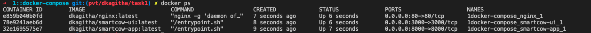
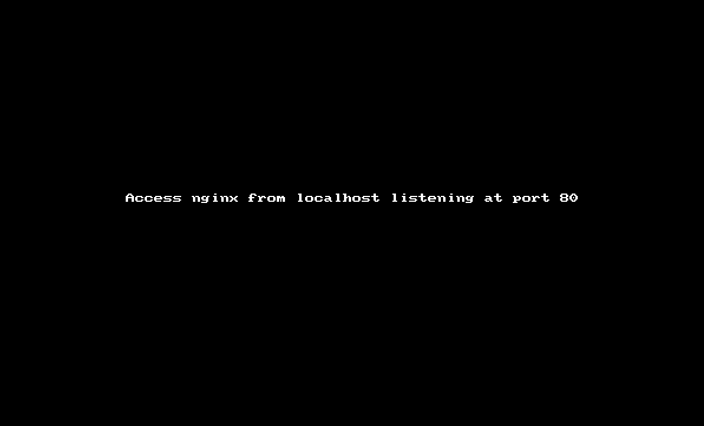

## SmartCow - Task 3::
### KUBERNETES - MINIKUBE SETUP [ MULTI CONTAINER SETUP ] + KUBERNETES [ MINIKUBE SETUP ]

`BUILD & PUSH THE IMAGES WITH DOCKER-COMPOSE :`

1. Stay at root (where you have the docker-compose.yml)
    ```bash
    $ cd <root directory > ex: 3::kubernetes
    ```    

2. `Build` the images 
    ```bash
    $ docker-compose build
    ```
3. `Run` the containers
    ```bash
    $ docker-compose up -d

    ```
4. Bring `down` the containers :  ***Optional***
    ```bash
    $ docker-compose down
    ```
5. Alternatively, can run `run_docker.sh` - it would delete currently running dockers on the local machine and rebuild the dockers and brung them up : ***Optional***
    ```bash
    $ cd <root directory > of the subproject => 3::kuberenetes
    $ ./run_docker.sh 
    ```
    

`DEPLOY THE APPLICATIONS VIA KUBERNETES`

6. Make sure the `minikube` setup is up and running on local machine using the driver as VirtualBox or Docker . Used `VirtualBox` for this setup

    ```bash
    minikube start --driver=virtualbox
    ```
7. Run the deployment 


`VALIDATE :`

1. Access SmartCow Stats UI on any `browser`

    ```bash
    $ http://localhost
    ```  
    `Recorded and attached a .gif for better review` 
    
    
   

    `Note` : UI would take ~1 min to come up and eventually for NGINX to proxy the request and send the response back to the browser


2. Can check the response of both the backend(flask) and frontend(node application) 

    `backend - gunicorn serving flask app exposed at 8000; endpoint "/stats"`
    ```bash
    $ http://localhost:8000/stats
    ```  
    
`CURRENT APPROACH :`

1. `Dockerise` the frontend, backend and the webserver/proxy (nginx) - `Refer `

2. Structure the existing into (reduced the tree level o/p to 4 as the `public` and `src` directory content is unaltered )

    ```bash
    ➜  3::kubernetes git:(pvt/dkagitha/task1) ✗ tree  -I 'smartCow-venv|node_modules|*pycache*|AWSCLIV2.pkg|img' -L 4
    .
    ├── README.md
    ├── api
    │   └── docker
    │       ├── Dockerfile
    │       ├── README.md
    │       ├── core
    │       │   ├── app.py
    │       │   └── requirements.txt
    │       └── entrypoint.sh
    ├── docker-compose.yml
    ├── manifests
    │   ├── sample.yml
    │   ├── smartcow-app.yml
    │   ├── smartcow-ingress-be.yml
    │   ├── smartcow-ingress-user.yml
    │   └── smartcow-ui.yml
    └── sys-stats
        ├── README.md
        └── docker
            ├── Dockerfile
            ├── core
            │   ├── package-lock.json
            │   ├── package.json
            │   ├── public
            │   ├── src
            │   └── yarn.lock
            └── entrypoint.sh

    9 directories, 18 files
    ```
    -  All the k8s manifest files are part of `manifest` directory
    - After build , images are pushed to `dkagitha/k8s-smartcow-app` and `dkagitha/k8s-smartcow-ui` repos in `dockerhub` registry

2. Setup `minikube` on local machine using the driver as VirtualBox or Docker . Used `VirtualBox` for this setup

3. Prepare the manifest files for flask and react app, 
    
    `3.1` : `smartcow-app` (flask)
    - `deployment` definition
        -  `replicas : 1` but can always be increased to desired number, by use of `scale` keyword in an `imperative statement` or by editing the deployment defintion file (`declartive approach`)
        -  `image : dkagitha/k8s-smartcow-app:latest` pulled from `dockerhub` 
        - `containerPort`: 8000
        - `labels :` 
            ```
            app: smartcow-app
            type: back-end
            ```
    - `service` definition
        - `type: NodePort`
        - `ports`
            ```
            port: 8000
            targetPort: 8000
            nodePort: 30883
            ```
    - `namespace` definition 
    - `ingress`:  

    `3.2` : `smartcow-ui` (react)
    - `deployment` definition
        -  `replicas : 1` but can always be increased to desired number, by use of `scale` keyword in an `imperative statement` or by editing the deployment defintion file (`declartive approach`)
        -  `image : dkagitha/k8s-smartcow-ui:latest` pulled from `dockerhub` 
        - `containerPort`: 3000
        - `labels :` 
            ```
            app: smartcow-ui
            type: front-end
            ```
    - `service` definition
        - `type: NodePort`
        - `ports`
            ```
            port: 3000
            targetPort: 3000
            nodePort: 30082
            ```
    - `namespace` definition 
  

`BEST PRACTICES :`

1. Usually in ideal setup, we ought to have 
    - Tests, 
    - Configuration and Data directories  
    - Log aggregrator (could be a custom choice as like we use in Oracle ( it's called `Lumberjack` ) or can choose any open source tool like `ELK`, `Graylog` or `Fluentd`)
    - Monitoring setup like `Prometheus`  
    - Build management tool related content like `gradle`   
    
    ```
    .
    ├── README.md
    ├── api
    │   └── docker
    │       ├── Dockerfile
    │       ├── README.md
    │       ├── core
    │       │   ├── app.py
    │       │   ├── requirements.txt
    │       │   └── wsgi.py
    │       └── entrypoint.sh
    ├── docker-compose.yml
    ├── nginx
    ├── build
    │   ├── README.md
    │   ├── classes
    │   ├── docker
    │   │   ├── Dockerfile
    │   │   ├── artifacts
    │   │   └── log_aggregator
    │   │            └── run
    │   ├── jacoco
    │   ├── libs
    │   ├── test-results
    │   ├── project.conf
    ├── run_docker.sh
    ├── build.gradle
    ├── gradle
    │   ├── docker.gradle
    │   └── wrapper
    │       ├── gradle-wrapper.jar
    │       └── gradle-wrapper.properties
    ├── gradle.properties
    ├── gradlew
    ├── gradlew.bat
    ├── settings.gradle
    └── src
        ├── main
        │   ├── PrometheustelemetryInitializer
        │   └── resources
        │       └── logback.xml

    ``` 


```bash
end_of_line = lf
```