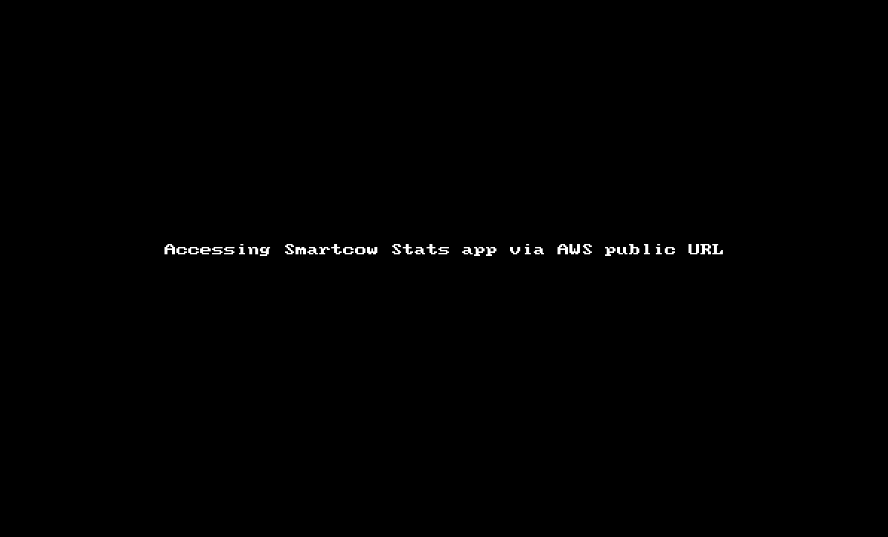
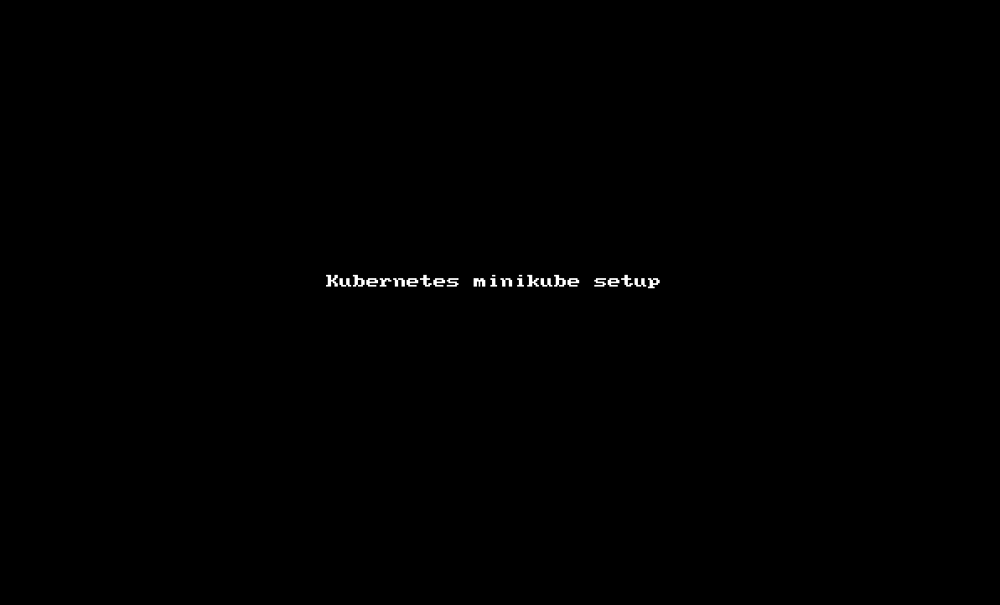

# **DevOps-Assignment**

### **TASK 1::DOCKER_COMPOSE** 

Approach and Best practices mentioned in repective README, link :
[1::docker-compose-README.md](1::docker-compose/README.md)

`Summary` 
    

### **TASK 2::CLOUD DEPLOY**

Approach and Best practices mentioned in repective README, link :
[2::cloud-deploy-aws-README.md](2::cloud-deploy/README.md)

`Summary` 
    

### **TASK 3::KUBERNETES- MINIKUBE**

Approach and Best practices mentioned in repective README, link :
[3::kubernetes-minikube-README.md](3::kubernetes/README.md)

`Summary` 
    

NOTE : Original `README.md` content moved to [REQUIREMENTS.md](REQUIREMENTS.md)